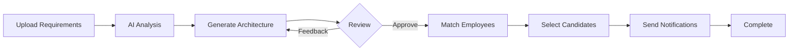

<div align="center">

# 🤖 SmartBench

### AI-Powered Intelligent Bench Allocation System

*Revolutionizing HR resource allocation with artificial intelligence*

[](https://www.python.org/)
[](https://streamlit.io/)
[](https://langchain.com/)
[](https://opensource.org/licenses/MIT)

[Features](#-features) • [Installation](#-installation) • [Usage](#-usage) • [Architecture](#-architecture) • [Contributing](#-contributing)

---

</div>

## 📖 About

**SmartBench** is an intelligent bench allocation platform that leverages AI to streamline HR operations. It analyzes project requirements, generates system architectures, matches suitable employees, and automates notifications—all through an intuitive Streamlit interface powered by Google's Gemini 2.0 Flash.

### 🎯 Why SmartBench?

- **⚡ Save Time**: Automate hours of manual resource allocation work
- **🎯 Better Matches**: AI-driven skill matching with confidence scores
- **📊 Visual Insights**: Auto-generated architecture diagrams and analytics
- **🔄 Iterative Design**: Regenerate architectures with natural language feedback
- **📧 Seamless Communication**: Built-in email notification system

---

## ✨ Features

### 🔍 **Intelligent Project Analysis**
Upload or paste project requirements and let AI extract:
- Required skills and competencies
- Technology stack recommendations
- Role definitions and team structure
- Resource allocation estimates

### 🏗️ **Smart Architecture Generation**
Automatically designs complete system architecture including:
- Frontend & Backend frameworks
- Database solutions
- Cloud infrastructure
- **Interactive Graphviz diagrams**
- Detailed module breakdowns

### ♻️ **Natural Language Architecture Refinement**
Modify architectures conversationally:
```
"Use Java instead of Python"
"Switch database to MongoDB"
"Add microservices architecture"
```

### 👥 **AI-Powered Employee Matching**
- Intelligent skill-to-requirement matching
- Percentage-based fit scores
- Expandable employee profile cards
- Detailed competency breakdown

### ✉️ **Automated Email Notifications**
- Personalized email templates
- Bulk employee notification
- Auto-cleanup after sending
- SMTP integration

---

## 🛠️ Tech Stack

<table>
<tr>
<td valign="top" width="50%">

### Backend & AI
- **Python** - Core language
- **Google Gemini 2.0 Flash** - AI engine
- **LangChain** - Agent orchestration
- **SMTP** - Email delivery

</td>
<td valign="top" width="50%">

### Frontend & Data
- **Streamlit** - Web interface
- **HTML/CSS** - Custom styling
- **JSON** - Local data storage
- **Graphviz** - Diagram generation

</td>
</tr>
</table>

---

## 📂 Project Structure

```
SmartBench/
│
├── 📄 app.py                    # Main Streamlit application
├── 📄 requirements.txt          # Python dependencies
├── 📄 .env                      # Environment configuration
├── 📄 README.md                 # Documentation
│
├── 🤖 agents/
│   ├── analyzer_agent.py        # Project analysis
│   ├── architect_agent.py       # Architecture generation
│   ├── matcher_agent.py         # Employee matching
│   └── notifier_agent.py        # Email notifications
│
└── 📊 data/
    └── projects/
        ├── project_001.txt      # Project requirements
        ├── analysis_001.json    # Analysis results
        ├── architecture_001.json # Architecture design
        ├── matches_001.json     # Match results
        └── final_matches.json   # Selected employees
```

---

## 🚀 Installation

### Prerequisites
- Python 3.8 or higher
- Gmail account (for email notifications)
- Google Gemini API key

### Step 1: Clone Repository
```bash
git clone https://github.com/Soham7021/SmartBench_AI.git
cd SmartBench
```

### Step 2: Create Virtual Environment

**Windows:**
```bash
python -m venv Smartbench
Smartbench\Scripts\activate
```

**macOS/Linux:**
```bash
python3 -m venv Smartbench
source Smartbench/bin/activate
```

### Step 3: Install Dependencies
```bash
pip install -r requirements.txt
```

### Step 4: Configure Environment Variables
Create a `.env` file in the root directory:

```env
# Google Gemini API
GOOGLE_API_KEY=your_gemini_api_key_here

# Email Configuration
SMTP_EMAIL=your_email@gmail.com
SMTP_PASSWORD=your_app_password
SMTP_SERVER=smtp.gmail.com
SMTP_PORT=587

# Optional: OpenRouter (if needed)
OPENROUTER_API_KEY=your_key_here
OPENROUTER_BASE_URL=https://openrouter.ai/api/v1
```

> **📝 Note:** For Gmail, you'll need to generate an [App Password](https://support.google.com/accounts/answer/185833)

### Step 5: Launch Application
```bash
streamlit run app.py
```

🎉 The app will automatically open at: **http://localhost:8501**

---

## 🔄 Workflow



### Detailed Steps:

1. **📝 Upload Requirements** → Stored in `project_001.txt`
2. **🔍 Analyze Project** → Results saved to `analysis_001.json`
3. **🏗️ Generate Architecture** → Diagram & specs in `architecture_001.json`
4. **👀 Review & Refine** → Optional regeneration with feedback
5. **👥 Match Employees** → Scores saved to `matches_001.json`
6. **✅ Select Candidates** → Finalized in `final_matches.json`
7. **📧 Send Notifications** → Automated emails dispatched
8. **🧹 Auto-Cleanup** → Final matches cleared for next project

---

## 📸 Screenshots

<div align="center">

### Project Analysis Dashboard
*AI-powered requirement extraction and analysis*

### Architecture Generator
*Visual system design with interactive diagrams*

### Employee Matching Interface
*Smart skill-based candidate recommendations*

</div>

---

## 🔮 Roadmap

- [ ] 🔐 **Authentication System** - Secure HR login
- [ ] 💾 **Database Integration** - PostgreSQL/MongoDB support
- [ ] ⏰ **Scheduled Automation** - Cron job integration
- [ ] 📊 **Admin Dashboard** - Analytics and insights
- [ ] 🎨 **Drag-Drop Architecture Editor** - Visual customization
- [ ] 🧠 **Advanced ML Models** - Enhanced skill matching algorithms
- [ ] 📱 **Mobile Responsive UI** - Cross-device compatibility
- [ ] 🔗 **API Endpoints** - RESTful API for integrations

---

## 🤝 Contributing

We welcome contributions! Here's how you can help:

1. **Fork** the repository
2. **Create** a feature branch (`git checkout -b feature/AmazingFeature`)
3. **Commit** your changes (`git commit -m 'Add AmazingFeature'`)
4. **Push** to the branch (`git push origin feature/AmazingFeature`)
5. **Open** a Pull Request

### Contribution Guidelines
- Write clear commit messages
- Add tests for new features
- Update documentation as needed
- Follow PEP 8 style guidelines

---

## 📄 License

This project is licensed under the **MIT License** - see the [LICENSE](LICENSE) file for details.

---

## 🙏 Acknowledgements

- [Google Gemini 2.0 Flash](https://deepmind.google/technologies/gemini/) - AI backbone
- [Streamlit](https://streamlit.io/) - Beautiful web framework
- [LangChain](https://langchain.com/) - Agent orchestration
- [Graphviz](https://graphviz.org/) - Diagram generation
- [OpenRouter](https://openrouter.ai/) - LLM routing (optional)

---

## 📞 Support

Have questions or need help?

- 📧 **Email**: [nimbalkarss123@gmail.com](mailto:your-email@example.com)
- 🐛 **Issues**: [GitHub Issues](https://github.com/Soham7021/SmartBench_AI/issues)
- 💬 **Discussions**: [GitHub Discussions](https://github.com/Soham7021/SmartBench_AI/discussions)

---

<div align="center">

### ⭐ Star this repository if you find it helpful!

**Made with ❤️ by the SmartBench Team**

[⬆ Back to Top](#-smartbench)

</div>